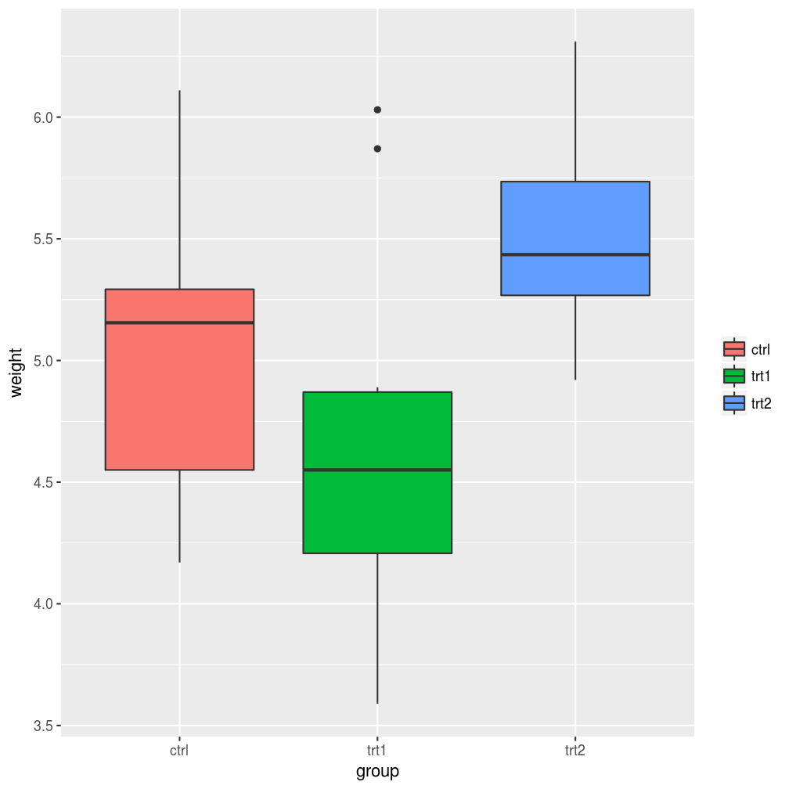
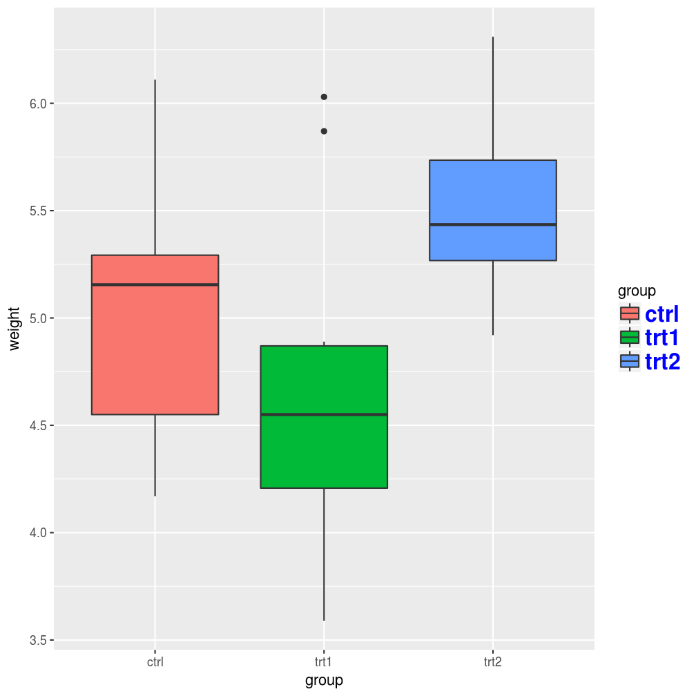
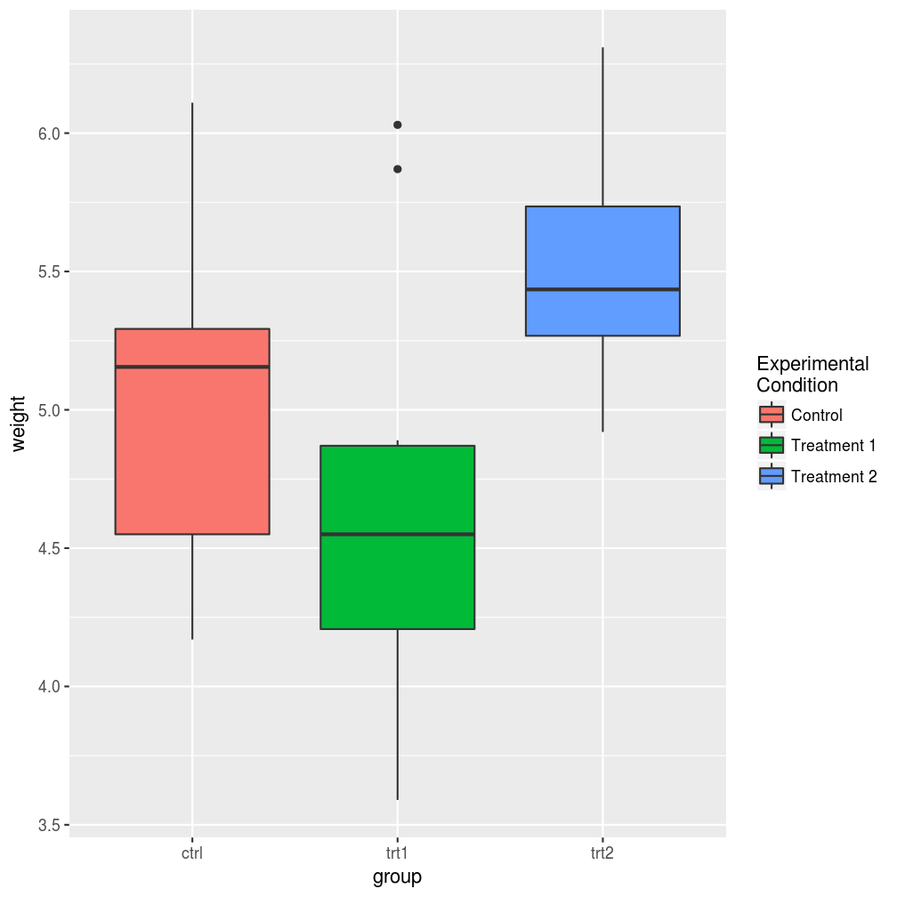
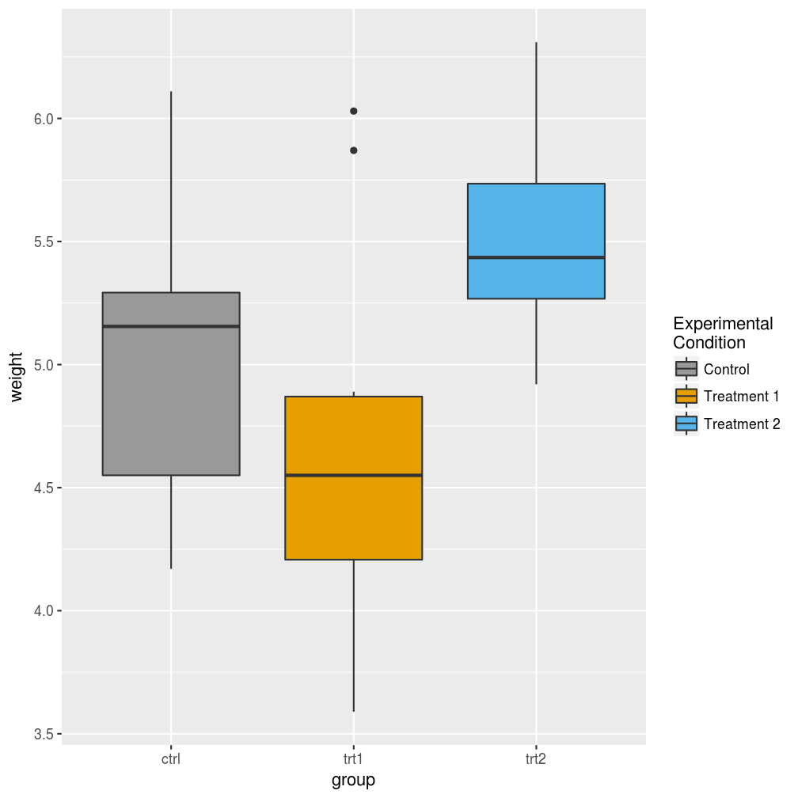

## Introdução

Agora que já temos em mãos as ferramentas para importar, arrumar e transformar os nossos dados, é hora de começarmos a extrair informações deles. Seguindo o nosso bom e velho ciclo da ciência de dados, o próximo passo é a construção de *visualizações*.


A visualização dos dados é uma etapa importantíssima da análise estatística, pois é a partir dela que criamos a intuição necessária para escolher o teste ou modelo mais adequado para o nosso problema.

Visualizações podem ser uma simples medida resumo (frequência, média, variância, mínimo, máximo, ...), um conjunto dessas medidas organizadas em uma tabela ou a representação (de uma parte) dos dados em um gráfico. Nesse tópico, focaremos na construção de gráficos, uma tarefa que, apesar de nem sempre ser conceitualmente ou tecnicamente trivial, é muito facilitada pelas ferramentas disponíveis no R.

Mas antes de mais nada, o que é um gráfico estatístico?

## Gráficos em camadas com o ggplot2

A construção de gráficos no R foi revolucionada com a criação do pacote `ggplot2`, fruto da tese de doutorado de [Hadley Wickham](https://github.com/hadley). Essa revolução teve base na filosofia adotada por Hadley ao definir o que deveria ser um gráfico estatístico.

Mas será que podemos definir formalmente o que é um gráfico estatístico? Graças ao estatístico norte-americano Leland Wilkinson, a resposta é sim.

Em 2005, Leland publicou o livro [*The Grammar of graphics*](http://www.springer.com/statistics/computational+statistics/book/978-0-387-24544-7), uma fonte de princípios fundamentais para a construção de gráficos estatísticos. No livro, ele defende que um gráfico é o mapeamento dos dados a partir de atributos estéticos (posição, cor, forma, tamanho) de objetos geométricos (pontos, linhas, barras, caixas).

A partir dessa definição, Hadley escreveu [A Layered Grammar of Graphics](http://vita.had.co.nz/papers/layered-grammar.html), sugerindo que os principais aspectos de um gráfico (dados, sistema de coordenadas, rótulos e anotações) podiam ser divididos em camadas, construídas uma a uma na elaboração do gráfico. Essa é a essência do `ggplot2`.

Além de uma filosofia bem fundamentada, o `ggplot2` ainda traz outras vantagens em relação aos gráficos do r base:

- gráficos naturalmente mais bonitos;
- muito mais fácil deixar o gráfico do jeito que você quer;
- a estrutura padronizada das funções deixa o aprendizado muito mais intuitivo; e
- é possível criar uma imensa gama de gráficos com poucas linhas de código.

Na próxima seção, vamos conhecer as principais funções do `ggplot2` e começar a construir nossos primeiros gráficos. Para isso, não se esqueça de instalar e carregar o pacote antes de tentar rodas os exemplos.


```r
install.packages("ggplot2")
library(ggplot2)
```


## Banco de dados

A seguir, vamos discutir os aspectos básicos para a construção de gráficos com o
pacote `ggplot2`. Para isso, utilizaremos o banco de dados contido no objeto `mtcars`.
Para visualizar as primeiras linhas deste banco, utilize o comando:


```r
head(mtcars)
##                    mpg cyl disp  hp drat    wt  qsec vs am gear carb
## Mazda RX4         21.0   6  160 110 3.90 2.620 16.46  0  1    4    4
## Mazda RX4 Wag     21.0   6  160 110 3.90 2.875 17.02  0  1    4    4
## Datsun 710        22.8   4  108  93 3.85 2.320 18.61  1  1    4    1
## Hornet 4 Drive    21.4   6  258 110 3.08 3.215 19.44  1  0    3    1
## Hornet Sportabout 18.7   8  360 175 3.15 3.440 17.02  0  0    3    2
## Valiant           18.1   6  225 105 2.76 3.460 20.22  1  0    3    1
```

O `mtcars` é um banco de dados de 1974 extraído da revista *Motor Trend US* que
compreende consumo de combustível e outros 10 aspectos de performance e engenharia
de 32 automóveis.

Entre as variáveis deste banco de dados estão:

- `mpg`: consumo de combustível (milhas por galão)
- `disp`: cilindrada, que é o [volume de deslocamento do motor](https://pt.wikipedia.org/wiki/Cilindrada)

Para saber mais sobre o `mtcarts`, digite `help(mtcars)`.

## As camadas de um gráfico

Antes de mais nada, vamos carregar o `ggplot2` usando:


```r
library(ggplot2)
```

No `ggplot2`, os gráficos são construídos camada por camada (ou, *layers*, em inglês),
sendo que a primeira delas é dada pela função `ggplot()` (não tem o "2"). Cada camada
representa um tipo de mapeamento ou personalização do gráfico. O código abaixo é um
exemplo de um gráfico bem simples, construído a partir das duas principais camadas. 


```r
ggplot(data = mtcars) + 
  geom_point(mapping = aes(x = disp, y = mpg))
```


Observe que o primeiro argumento da função `ggplot` é um data frame. A função `aes()`
descreve como as variáveis são mapeadas em aspectos visuais de formas geométricas
definidas pelos *geoms*. Aqui, essas formas geométricas são pontos, selecionados pela
função `geom_point()`, gerando, assim, um gráfico de dispersão. A combinação dessas
duas camadas define o tipo de gráfico que você deseja construir.

## Aesthetics

A primeira camada de um gráfico deve indicar a relação entre os dados e cada aspecto
visual do gráfico, como qual variável será representada no eixo x, qual será
representada no eixo y, a cor e o tamanho dos componentes geométricos etc. Os aspectos
que podem ou devem ser mapeados depende do tipo de gráfico que você deseja fazer.

No exemplo acima, atribuímos aspectos de posição: ao eixo y mapeamos a variável `mpg`
(milhas por galão) e ao eixo x a variável `disp` (cilindradas). Outro aspecto que pode
ser mapeado nesse gráfico é a cor dos pontos


```r
ggplot(data = mtcars) + 
  geom_point(mapping = aes(x = disp, y = mpg, colour = as.factor(am)))
```


Agora, a variável `am` (tipo de transmissão) foi mapeada à cor dos pontos, sendo que pontos vermelhos correspondem à transmissão automática (valor 0) e pontos azuis à transmissão manual (valor 1). Observe que inserimos a variável `am` como um fator, pois temos interesse apenas nos valores "0" e "1". No entanto, também podemos mapear uma variável contínua à cor dos pontos:


```r
ggplot(mtcars) + 
  geom_point(mapping = aes(x = disp, y = mpg, colour = cyl))
```


Aqui, o número de cilindros, `cyl`, é representado pela tonalidade da cor azul.

**Nota**: por *default*, a legenda é insirida no gráfico automaticamente.

Também podemos mapear o tamanho dos pontos a uma variável de interesse:


```r
ggplot(mtcars) +
  geom_point(mapping = aes(x = disp, y = mpg, colour = cyl, size = wt))
```


**Exercício**: pesquisar mais aspectos que podem ser alterados no gráfico de dispersão. [Essa](http://ggplot2.tidyverse.org/articles/ggplot2-specs.html) é uma
boa referência.

## Geoms

Os *geoms* definem qual forma geométrica será utilizada para a visualização dos 
dados no gráfico. Como já vimos, a função `geom_point()` gera gráficos de dispersão
transformando pares (x,y) em pontos. Veja a seguir outros *geoms* bastante utilizados:

- `geom_line` - para linhas definidas por pares (x,y)
- `geom_abline` - para retas definidas por um intercepto e uma inclinação
- `geom_hline` - para retas horizontais
- `geom_boxplot` - para boxplots
- `geom_histogram` - para histogramas
- `geom_density` - para densidades
- `geom_area` - para áreas
- `geom_bar` - para barras

Veja a seguir como é fácil gerar diversos gráficos diferentes utilizando a mesma estrutura do gráfico de dispersão acima:


```r
ggplot(mtcars) + 
  geom_boxplot(aes(x = as.factor(cyl), y = mpg))
```


**Note** que para fazer um boxplot para cada grupo, precisamos passar para o aspecto
x do gráfico uma variável do tipo `factor`.


```r
ggplot(mtcars) + 
  geom_histogram(aes(x = mpg))
## `stat_bin()` using `bins = 30`. Pick better value with `binwidth`.
```


```r
ggplot(mtcars) + 
  geom_bar(aes(x = as.factor(cyl)))
```


<div class='admonition note'>
<p class='admonition-title'>
Um padrão para os gráficos
</p>
<p>
Você deve ter percebido que, para fazer um gráfico usando `ggplot2` e a gramática
dos gráficos, existe um padrão:
<br> 
<br>
ggplot(data = DATA) + GEOM_FUNCTION(mapping = aes(MAPPINGS))
<br>
<br>
Para fazer um gráfico, basta substituir DATA por um banco de dados, GEOM_FUNCTION por
uma função geométrica e MAPPINGS por uma coleção de <b>mapas estéticos</b>. Isso será muito útil quando você for fazer o seu próprio gráfico.
</p>
</div>

### Exercícios

1. Rode `ggplot(data = mtcars)`. O que você vê?
2. Quantas linhas existem no `mtcars`. Quantas colunas? **Dica**: use a função `nrows`.
3. O que a variável `qsec` descreve. Leia o help do `mtcars` para encontrar.
4. Faça um gráfico de dispersão de `mpg` por `qsec`
5. O que acontece se você fizer um gráfico de dispersão de `vs` por `mpg`? Porque o 
gráfico não é útil?

## Combinando gráficos

Considere os 2 gráficos a seguir.


```r
# esquerda
ggplot(mtcars) + 
  geom_point(aes(y = mpg, x = disp))
# direita
ggplot(mtcars) + 
  geom_smooth(aes(y = mpg, x = disp))
## `geom_smooth()` using method = 'loess'
```


Os gráficos são similares e completaam-se. O da esquerda, mostra como os pontos estão distribuídos. Ele mostra uma tendência de aumento do consumo de combustível de acordo
com as cilindradas. Já o gráfico da direita resume essa relação. Simplificando-a para uma linha de tendência com alguma margem de confiança. 

Esses dois gráficos se completam e ficam bons juntos. Com o `ggplot2`, é muito fácil
sobrepor os dois gráficos, pois ele é pensado para que cada gráfico seja feito com
uma combinação de camadas. Veja o código abaixo.


```r
ggplot(mtcars) + 
  geom_point(aes(y = mpg, x = disp)) +
  geom_smooth(aes(y = mpg, x = disp))
## `geom_smooth()` using method = 'loess'
```


Desta forma, sobrepusemos os pontos e a linha de suavização. No entanto, duplicamos alguns trechos no nosso código, o que geralmente não é bom. Imagine se você precisar
mudar a variável do eixo `y`, você precisará trocar o nome da variável em mais de um
lugar do código. Para resolver isso, você pode definir o *mapping* apenas uma vez
dentro da declaração do gráfico, conforme o código a seguir.


```r
ggplot(mtcars, aes(y = mpg, x = disp)) + 
  geom_point() +
  geom_smooth()
## `geom_smooth()` using method = 'loess'
```


Veja que isso gera o mesmo gráfico!

Veja que mesmo com dois `geom`'s, o `ggplot` segue a mesma regra para mapear as
variáveis para as `aesthetics`. Por exemplo, se você mapear uma variável para 
a cor, você obterá o seguinte gráfico.


```r
ggplot(mtcars, aes(y = mpg, x = disp, colour = as.factor(cyl))) + 
  geom_point() +
  geom_smooth(method = "lm")
```


O `ggplot2` agora desenhou uma reta para cada um dos grupos de pontos e coloriu
cada grupo de pontos de uma cor diferente. Em alguns casos, você pode querer mapear
a cor em apenas uma das camadas do gráfico. Isso pode ser feito da seguinte forma:


```r
ggplot(mtcars, aes(y = mpg, x = disp)) + 
  geom_point(aes(colour = as.factor(cyl))) +
  geom_smooth(method = "lm")
```


Agora, cada grupo de pontos tem uma cor, mas a reta é única para todos os pontos.

## Alterando os padrões do gráfico

Até agora, sempre *mapeamos* uma forma estética à uma variável. Muitas vezes 
queremos apenas modificar esta forma estética sem mapeá-la a outra variável.
Por exemplo, no gráfico a seguir, modificamos a cor de todos os pontos.


```r
ggplot(mtcars, aes(y = mpg, x = disp)) + 
  geom_point(colour = "red")
```


A principal diferença aqui é que especificamos o argumento `colour` fora da função
`aes`. Dessa forma, podemos controlar todos os parâmetros 
de cada forma geométrica. 


```r
ggplot(mtcars, aes(y = mpg, x = disp)) + 
  geom_point(colour = "red", size = 2, shape = 3, alpha = 0.5)
```


## Facets

Uma funcionalidade muito útil do `ggplot2` é a possibilidade de usar `facets`.
Isso auxilia na visualização de diferentes subconjuntos dos dados em gráficos
separados, permitindo a visualização de comportamentos diferentes dependendo
do grupo.


```r
ggplot(mtcars, aes(y = mpg, x = disp)) + 
  geom_point() +
  geom_smooth(method = "lm") + 
  facet_wrap(~am)
```


No gráfico acima, rapidamente conseguimos visualizar que se o carro não é automático o consumo de combustível é muito menor do que quando o carro é automático. Também conseguimos ver que a inclinação das retas é bem diferente dependendo do carro ser
automático/manual.


### **Exercício**

1. O que tem de errado no código abaixo? Por que os pontos não ficaram azuis?


```r
ggplot(data = mpg) + 
  geom_point(mapping = aes(x = displ, y = hwy, color = "blue"))
```


2. Mapeie uma variável contínua para uma cor, tamanho e forma. Como essas formas
estéticas se comportam diferente para variáveis categóricas vs. contínuas?


Começando de um simples boxplot feito no `ggplot2` vamos fazer diversas alterações nas legendas. O gráfico inicial é construido da seguinte forma:


```r
library(ggplot2)
# boxplot simples
bp <- ggplot(data=PlantGrowth, aes(x=group, y=weight, fill=group)) + geom_boxplot()
bp
```


## Removendo totalmente a legenda

Existem diversas maneiras para remover a legenda de um gráfico no `ggplot2`. A forma mais simples é usar `guides(fill = FALSE)` com `fill` sendo o atributo gráfico do qual você deseja remover a legenda.


```r
# aqui definimos fill = FALSE, porque é o atributo do gráfico que relacionamos 
# a alguma variável.
bp + guides(fill = FALSE)

# também é possível remover a legenda por meio da escala de cores
# aqui também usamos o scale_fill_discrete, porque associamos fill
# a uma variável anteriormente.
bp + scale_fill_discrete(guide = F)
```


```r
# o comando a seguir remove todas as legendas, não importa o atributo que ela
# esteja representando.
bp + theme(legend.position="none")
```




## Alterando a ordem dos itens

Para alterar a ordem dos itens na legenda do gráfico no `ggplot2`, usamos o comando da escala de cores.


```r
bp + scale_fill_discrete(breaks=c("trt1","ctrl","trt2"))
```


```r
bp
```


Dependendo dos aspectos gráficos (cores, formatos, preenchimentos) especificados, você pode precisar usar alguma das seguintes funções: `scale_fill_manual`, `scale_colour_hue`, `scale_colour_manual`, `scale_shape_discrete`, `scale_linetype_discrete`.

Você pode também querer inverter a ordem dos itens da legenda. Isso pode ser feito de uma das seguintes maneiras.


```r
bp + guides(fill = guide_legend(reverse=TRUE))
bp + scale_fill_discrete(guide = guide_legend(reverse=TRUE))
```


## Removendo os títulos da legenda

Algumas vezes é necessário remover o título das legendas do gráfico feito no `ggplot2`.
Veja a seguir algumas maneiras:


```r
# Remove o título apenas da legenda do preenchimento (fill)
bp + guides(fill=guide_legend(title=NULL))

# Remove o título de todas as legendas
bp + theme(legend.title=element_blank())
```



## Modificando texto, cores e rótulos

Existem duas formas para modificar os textos e rótulos das legendas. Uma delas é modificar o `data.frame` de forma com que os fatores tenham o mesmo nome que você deseja na legenda. Outra forma é usando as funções de `scale`. 

Veja algumas modificações que podem ser feitas por meio das funções de `scale`. Como a variável `group` está associada ao atributo `fill`, usamos as funções `scale_fill_xxx`.


```r
# usamos scale_fill_discrete porque não queremos alterar as cores padrão,
# mas queremos que cada fator esteja associado a uma cor de tom diferente.
# mudamos aqui os rótulos e o título da legenda.
bp + scale_fill_discrete(name="Experimental\nCondition",
                         breaks=c("ctrl", "trt1", "trt2"),
                         labels=c("Control", "Treatment 1", "Treatment 2"))


# usamos scale_fill_manual porque queremos alterar as cores padrão.
# aqui escolhemos as cores da escala hexadecimal.
bp + scale_fill_manual(values=c("#999999", "#E69F00", "#56B4E9"), 
                       name="Experimental\nCondition",
                       breaks=c("ctrl", "trt1", "trt2"),
                       labels=c("Control", "Treatment 1", "Treatment 2"))
```



Veja que isso não aletrou o eixo X do gráfico.

## Modificando a aparência da legenda

Existem inúmeras modificações que podem ser realizadas na aparência da legenda. Todas elas estão relacionadas à modificação do `element_text`. Veja neste [link](http://docs.ggplot2.org/0.9.2.1/element_text.html) todos os atributos que podem ser modificados.


```r
# Mudando a aparência do título
bp + theme(legend.title = element_text(colour="blue", size=16, face="bold"))
```


```r
# Mudando a aparência dos rótulos
bp + theme(legend.text = element_text(colour="blue", size = 16, face = "bold"))
```


## Modificando a posição da legenda

É possível controlar a posição da legenda facilmente escolhendo uma das posições (left/right/top/bottom).


```r
bp + theme(legend.position="top")
```


Também é possível controlar a posição da legenda de forma precisa usando a função `theme()`. A legenda será posicionada dentro do gráfico com o ponto central sendo o valor do argumento `legend.position`. Esses valores são definidos de forma que o ponto (0,0) seja o canto inferior esquerdo e (1,1) seja o canto superior direito.


```r
bp + theme(legend.position=c(.5, .5))
```


