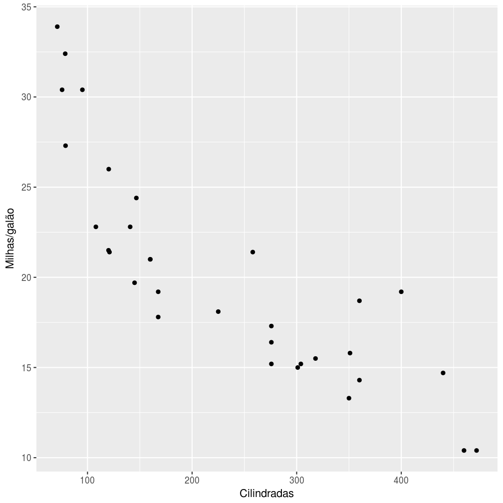
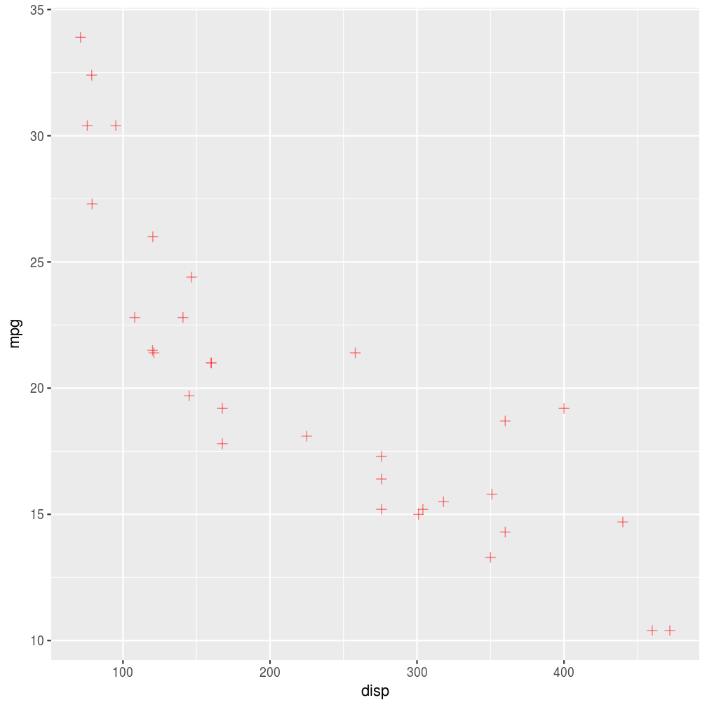
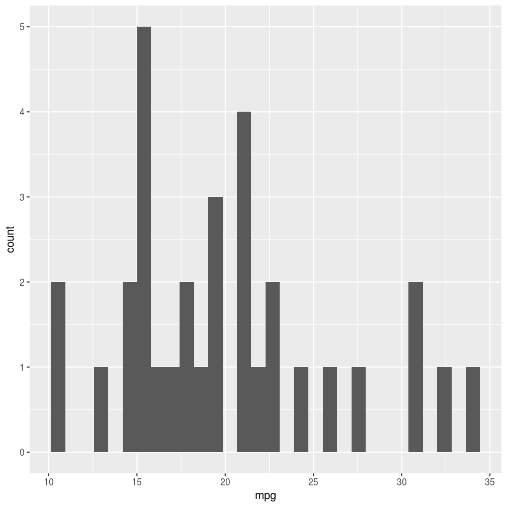
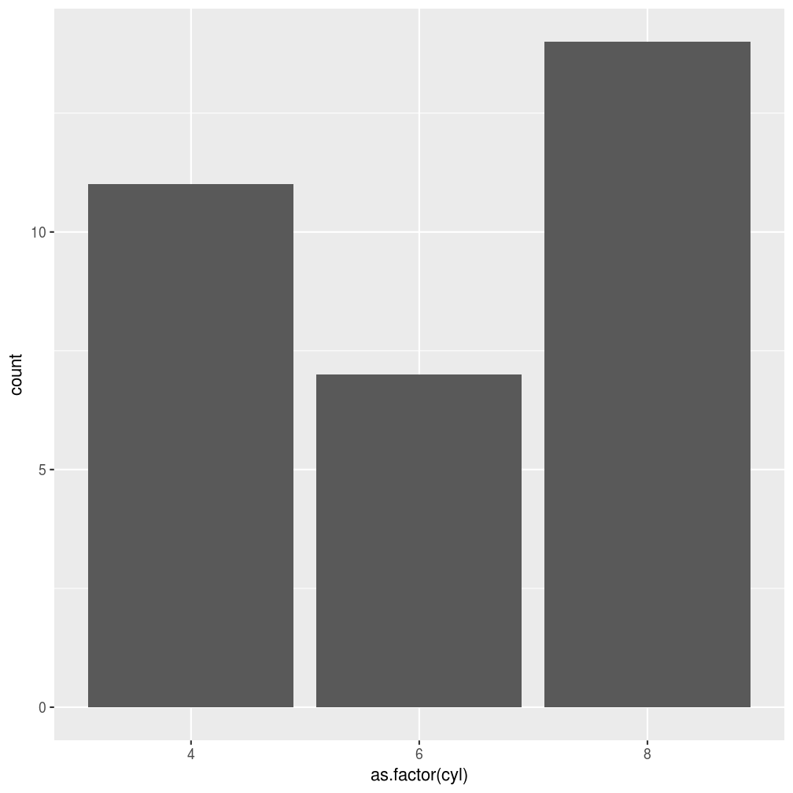
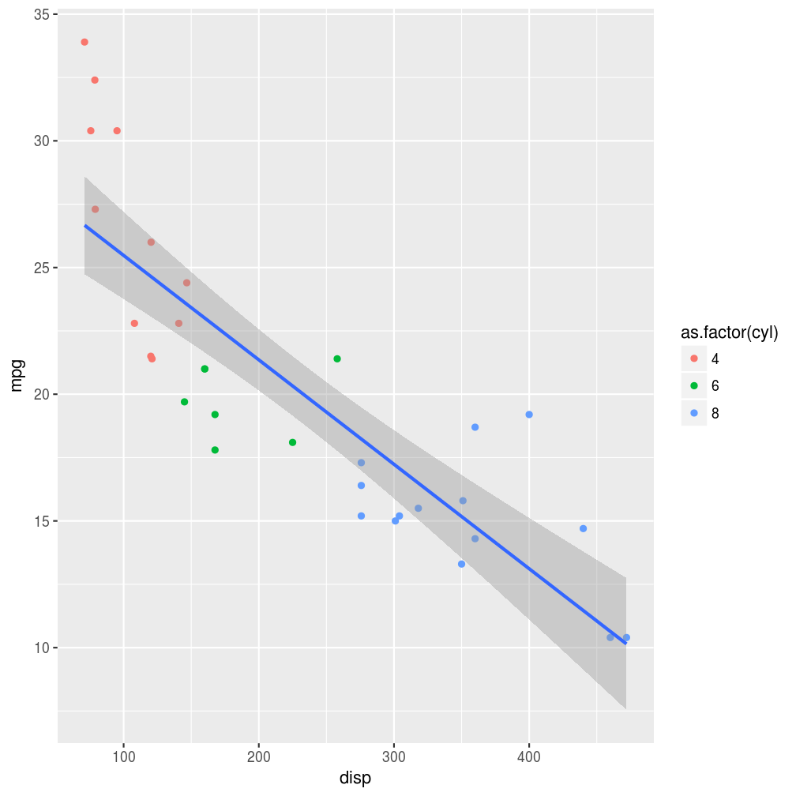

## Introdução

Agora que já temos em mãos as ferramentas para importar, arrumar e transformar os nossos dados, é hora de começarmos a extrair informações deles. Seguindo o nosso bom e velho ciclo da ciência de dados, o próximo passo é a construção de *visualizações*.


A visualização dos dados é uma etapa importantíssima da análise estatística, pois é a partir dela que criamos a intuição necessária para escolher o teste ou modelo mais adequado para o nosso problema.

Visualizações podem ser uma simples medida resumo (frequência, média, variância, mínimo, máximo, ...), um conjunto dessas medidas organizadas em uma tabela ou a representação (de uma parte) dos dados em um gráfico. Nesse tópico, focaremos na construção de gráficos, uma tarefa que, apesar de nem sempre ser conceitualmente ou tecnicamente trivial, é muito facilitada pelas ferramentas disponíveis no R.

Mas antes de mais nada, o que é um gráfico estatístico?

## O que é um gráfico?

A construção de gráficos no R foi revolucionada com a criação do pacote `ggplot2`, fruto da tese de doutorado de [Hadley Wickham](https://github.com/hadley). Essa revolução teve base na filosofia adotada por Hadley ao definir o que deveria ser um gráfico estatístico.

Mas será que podemos definir formalmente o que é um gráfico estatístico? Graças ao estatístico norte-americano Leland Wilkinson, a resposta é sim.

Em 2005, Leland publicou o livro [*The Grammar of graphics*](http://www.springer.com/statistics/computational+statistics/book/978-0-387-24544-7), uma fonte de princípios fundamentais para a construção de gráficos estatísticos. No livro, ele defende que um gráfico é o mapeamento dos dados a partir de atributos estéticos (posição, cor, forma, tamanho) de objetos geométricos (pontos, linhas, barras, caixas).

A partir dessa definição, Hadley escreveu [A Layered Grammar of Graphics](http://vita.had.co.nz/papers/layered-grammar.html), sugerindo que os principais aspectos de um gráfico (dados, sistema de coordenadas, rótulos e anotações) podiam ser divididos em camadas, construídas uma a uma na elaboração do gráfico. Essa é a essência do `ggplot2`.

Além de uma filosofia bem fundamentada, o `ggplot2` ainda traz outras vantagens em relação aos gráficos do r base:

- gráficos naturalmente mais bonitos;
- muito mais fácil deixar o gráfico do jeito que você quer;
- a estrutura padronizada das funções deixa o aprendizado muito mais intuitivo; e
- é possível criar uma imensa gama de gráficos com poucas linhas de código.

Para discutir os principais aspectos da construção de gráficos com o `ggplot2`, vamos utilizar a base disponível no objeto `mtcars`. Essa base de 1974 contém dados extraídos da revista *Motor Trend US* sobre o consumo de combustível e características de performance e engenharia de 32 automóveis.

Se você não está familiarizado com esta base, rode `help(mtcars)` para mais informações.

Na próxima seção, vamos conhecer as principais funções do `ggplot2` e começar a construir nossos primeiros gráficos. Não se esqueça de instalar e carregar o pacote antes de tentar rodas os exemplos.


```r
install.packages("ggplot2")
library(ggplot2)
```


## As camadas de um gráfico

No `ggplot2`, os gráficos são construídos camada por camada (ou, *layers*, em inglês), sendo a primeira delas dada pela função `ggplot()` (repare que não tem o "2"). Essa função recebe um data frame e cria a camada base do gráfico. Se rodarmos apenas a função `ggplot()`, obteremos um painel em branco.


```r
ggplot(data = mtcars)
```


Apesar de termos passados os dados para a função, precisamos especificar como as obsevações serão mapeadas nos aspectos visuais do gráfico e quais formas geométricas serão utilizadas para isso. Cada camada do gráfico representará um tipo de mapeamento ou personalização. O código abaixo é um exemplo de um gráfico bem simples, construído a partir das duas principais camadas. 


```r
ggplot(data = mtcars) + 
  geom_point(mapping = aes(x = disp, y = mpg))
```


A figura gerada pelo código acima é um gráfico de dispersão. Observe que:

- como vimos, a primeira camada é dada pela função `ggplot()` e recebe um data frame;
- a segunda camada é dada pela função `geom_point()`, especificando a forma **geom**étrica utilizada no mapeamento das observações;
- as camadas são somadas com um `+`;
- o mapeamento na função `geom_point()` recebe a função `aes()`, responsável por descrever como as variáveis serão mapeadas nos aspectos visuais da forma geométrica escolhida, no caso, pontos.

A combinação da função `ggplot()` e de uma ou mais funções `geom_()` definirá o tipo de gráfico gerado.

<div class='admonition note'>
<p class='admonition-title'>
Cuidado
</p>
<p>
As camadas dos gráficos são empilhadas utilizando-se o sinal +. Como a estrutura é muito parecida com uma pipe line, é comum trocarmos o + por um %>% no meio do código.
</p>
</div>

Podemos acrescentar uma terceira camada ao gráfico, agora com uma personalização. Repare como é simples acrescentar labels ao gráfico com a função `labs()`.


```r
ggplot(data = mtcars) + 
  geom_point(mapping = aes(x = disp, y = mpg)) +
  labs(x = "Cilindradas", y = "Milhas/galão")
```



Agora que você já sabe como a estrutura de camadas do `ggplot` funciona, vamos estudar com mais atenção para que serve a função `aes()`.

## Aesthetics

A primeira camada de um gráfico deve indicar a relação entre os dados e cada aspecto
visual do gráfico, como qual variável será representada no eixo x, qual será
representada no eixo y, a cor e o tamanho dos componentes geométricos etc. Os aspectos
que podem ou devem ser mapeados depende do tipo de gráfico que você deseja fazer.

No exemplo acima, atribuímos aspectos de posição: ao eixo y mapeamos a variável `mpg`
(milhas por galão) e ao eixo x a variável `disp` (cilindradas). Outro aspecto que pode
ser mapeado nesse gráfico é a cor dos pontos


```r
ggplot(data = mtcars) + 
  geom_point(mapping = aes(x = disp, y = mpg, colour = as.factor(am)))
```


Agora, a variável `am` (tipo de transmissão) foi mapeada à cor dos pontos, sendo que pontos vermelhos correspondem à transmissão automática (valor 0) e pontos azuis à transmissão manual (valor 1). Observe que inserimos a variável `am` como um fator, pois temos interesse apenas nos valores "0" e "1". No entanto, também podemos mapear uma variável contínua à cor dos pontos:


```r
ggplot(mtcars) + 
  geom_point(mapping = aes(x = disp, y = mpg, colour = cyl))
```


Aqui, o número de cilindros, `cyl`, é representado pela tonalidade da cor azul.

**Nota**: por *default*, a legenda é insirida no gráfico automaticamente.

Também podemos mapear o tamanho dos pontos a uma variável de interesse:


```r
ggplot(mtcars) +
  geom_point(mapping = aes(x = disp, y = mpg, colour = cyl, size = wt))
```


**Exercício**: pesquisar mais aspectos que podem ser alterados no gráfico de dispersão. [Essa](http://ggplot2.tidyverse.org/articles/ggplot2-specs.html) é uma
boa referência.

## Geoms

Os *geoms* definem qual forma geométrica será utilizada para a visualização dos 
dados no gráfico. Como já vimos, a função `geom_point()` gera gráficos de dispersão
transformando pares (x,y) em pontos. Veja a seguir outros *geoms* bastante utilizados:

- `geom_line` - para linhas definidas por pares (x,y)
- `geom_abline` - para retas definidas por um intercepto e uma inclinação
- `geom_hline` - para retas horizontais
- `geom_boxplot` - para boxplots
- `geom_histogram` - para histogramas
- `geom_density` - para densidades
- `geom_area` - para áreas
- `geom_bar` - para barras

Veja a seguir como é fácil gerar diversos gráficos diferentes utilizando a mesma estrutura do gráfico de dispersão acima:


```r
ggplot(mtcars) + 
  geom_boxplot(aes(x = as.factor(cyl), y = mpg))
```


**Note** que para fazer um boxplot para cada grupo, precisamos passar para o aspecto
x do gráfico uma variável do tipo `factor`.


```r
ggplot(mtcars) + 
  geom_histogram(aes(x = mpg))
## `stat_bin()` using `bins = 30`. Pick better value with `binwidth`.
```




```r
ggplot(mtcars) + 
  geom_bar(aes(x = as.factor(cyl)))
```


<div class='admonition note'>
<p class='admonition-title'>
Um padrão para os gráficos
</p>
<p>
Você deve ter percebido que, para fazer um gráfico usando `ggplot2` e a gramática
dos gráficos, existe um padrão:
<br> 
<br>
ggplot(data = DATA) + GEOM_FUNCTION(mapping = aes(MAPPINGS))
<br>
<br>
Para fazer um gráfico, basta substituir DATA por um banco de dados, GEOM_FUNCTION por
uma função geométrica e MAPPINGS por uma coleção de <b>mapas estéticos</b>. Isso será muito útil quando você for fazer o seu próprio gráfico.
</p>
</div>

### Exercícios

1. Rode `ggplot(data = mtcars)`. O que você vê?
2. Quantas linhas existem no `mtcars`. Quantas colunas? **Dica**: use a função `nrows`.
3. O que a variável `qsec` descreve. Leia o help do `mtcars` para encontrar.
4. Faça um gráfico de dispersão de `mpg` por `qsec`
5. O que acontece se você fizer um gráfico de dispersão de `vs` por `mpg`? Porque o 
gráfico não é útil?

## Combinando gráficos

Considere os 2 gráficos a seguir.


```r
# esquerda
ggplot(mtcars) + 
  geom_point(aes(y = mpg, x = disp))
# direita
ggplot(mtcars) + 
  geom_smooth(aes(y = mpg, x = disp))
## `geom_smooth()` using method = 'loess'
```


Os gráficos são similares e completaam-se. O da esquerda, mostra como os pontos estão distribuídos. Ele mostra uma tendência de aumento do consumo de combustível de acordo
com as cilindradas. Já o gráfico da direita resume essa relação. Simplificando-a para uma linha de tendência com alguma margem de confiança. 

Esses dois gráficos se completam e ficam bons juntos. Com o `ggplot2`, é muito fácil
sobrepor os dois gráficos, pois ele é pensado para que cada gráfico seja feito com
uma combinação de camadas. Veja o código abaixo.


```r
ggplot(mtcars) + 
  geom_point(aes(y = mpg, x = disp)) +
  geom_smooth(aes(y = mpg, x = disp))
## `geom_smooth()` using method = 'loess'
```



Desta forma, sobrepusemos os pontos e a linha de suavização. No entanto, duplicamos alguns trechos no nosso código, o que geralmente não é bom. Imagine se você precisar
mudar a variável do eixo `y`, você precisará trocar o nome da variável em mais de um
lugar do código. Para resolver isso, você pode definir o *mapping* apenas uma vez
dentro da declaração do gráfico, conforme o código a seguir.


```r
ggplot(mtcars, aes(y = mpg, x = disp)) + 
  geom_point() +
  geom_smooth()
## `geom_smooth()` using method = 'loess'
```



Veja que isso gera o mesmo gráfico!

Veja que mesmo com dois `geom`'s, o `ggplot` segue a mesma regra para mapear as
variáveis para as `aesthetics`. Por exemplo, se você mapear uma variável para 
a cor, você obterá o seguinte gráfico.


```r
ggplot(mtcars, aes(y = mpg, x = disp, colour = as.factor(cyl))) + 
  geom_point() +
  geom_smooth(method = "lm")
```


O `ggplot2` agora desenhou uma reta para cada um dos grupos de pontos e coloriu
cada grupo de pontos de uma cor diferente. Em alguns casos, você pode querer mapear
a cor em apenas uma das camadas do gráfico. Isso pode ser feito da seguinte forma:


```r
ggplot(mtcars, aes(y = mpg, x = disp)) + 
  geom_point(aes(colour = as.factor(cyl))) +
  geom_smooth(method = "lm")
```


Agora, cada grupo de pontos tem uma cor, mas a reta é única para todos os pontos.

## Alterando os padrões do gráfico

Até agora, sempre *mapeamos* uma forma estética à uma variável. Muitas vezes 
queremos apenas modificar esta forma estética sem mapeá-la a outra variável.
Por exemplo, no gráfico a seguir, modificamos a cor de todos os pontos.


```r
ggplot(mtcars, aes(y = mpg, x = disp)) + 
  geom_point(colour = "red")
```


A principal diferença aqui é que especificamos o argumento `colour` fora da função
`aes`. Dessa forma, podemos controlar todos os parâmetros 
de cada forma geométrica. 


```r
ggplot(mtcars, aes(y = mpg, x = disp)) + 
  geom_point(colour = "red", size = 2, shape = 3, alpha = 0.5)
```



## Facets

Uma funcionalidade muito útil do `ggplot2` é a possibilidade de usar `facets`.
Isso auxilia na visualização de diferentes subconjuntos dos dados em gráficos
separados, permitindo a visualização de comportamentos diferentes dependendo
do grupo.


```r
ggplot(mtcars, aes(y = mpg, x = disp)) + 
  geom_point() +
  geom_smooth(method = "lm") + 
  facet_wrap(~am)
```


No gráfico acima, rapidamente conseguimos visualizar que se o carro não é automático o consumo de combustível é muito menor do que quando o carro é automático. Também conseguimos ver que a inclinação das retas é bem diferente dependendo do carro ser
automático/manual.


